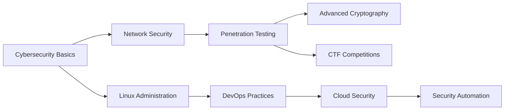

<div align="center">


[](https://git.io/typing-svg)

[](https://github.com/senura-404)


*"Security is not a product, but a process."*

---

### 🎯 About Me

```yaml
name: Senura Buthmin
role: Undergraduate Student
focus: [Cybersecurity, DevOps, System Security]
location: Sri Lanka
interests: [Penetration Testing, Cloud Security, Infrastructure Automation]
philosophy: "Breaking things to make them stronger 🛡️"
editor: "Text editors > IDEs (vim/neovim supremacy!)"
```

</div>


---

## 🔐 Current Focus

- 🔨 **Building:** [C-based Keylogger](https://github.com/SENURA-404/keylogger) - Low-level system programming project
- 📚 **Learning:** Cryptography, Python Security Tools, Rust for Systems Programming, Advanced Bash Scripting
- 🎯 **Goals:** Contribute to open-source security tools & build robust DevOps pipelines
- 🤝 **Open to:** Collaboration on security tools, CTF challenges, and DevOps automation


---

## 💼 Expertise Areas

<div align="center">

### 🛡️ Security


### ⚙️ DevOps & Cloud


</div>

---

## 🛠️ Tech Stack

<div align="center">

### Languages


### Tools & Platforms


### Design


</div>


---

## 📊 GitHub Analytics

<div align="center">

[](https://git.io/streak-stats)


[](https://github.com/senura-404)

</div>


---

## ✍️ Latest Blog Posts

<!-- BLOG-POST-LIST:START -->
📝 I regularly share insights on cybersecurity, CTF writeups, and DevOps practices on [Medium](https://medium.com/@senurabuthmindpcsmf)
<!-- BLOG-POST-LIST:END -->


---

## 🤝 Connect With Me

<div align="center">

[](https://linkedin.com/in/senura-buthmin)
[](https://medium.com/@senurabuthmin)
[](https://instagram.com/s_3_n_u_r_a)
[](https://fb.com/senura-buthmin)
[](https://stackoverflow.com/users/senura-buthmin)

📧 **Email:** [senurabuthmindpcsmf@gmail.com](mailto:senurabuthmindpcsmf@gmail.com)

</div>


---

## 🎓 Learning Journey




---

<div align="center">

### 💡 "The only truly secure system is one that is powered off, cast in a block of concrete and sealed in a lead-lined room with armed guards." 
*- Gene Spafford*

<br>

**⭐ If you find my projects interesting, consider starring them!**

<br>


</div>
